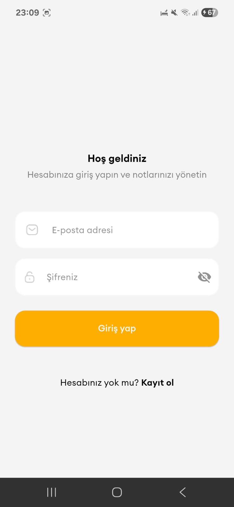
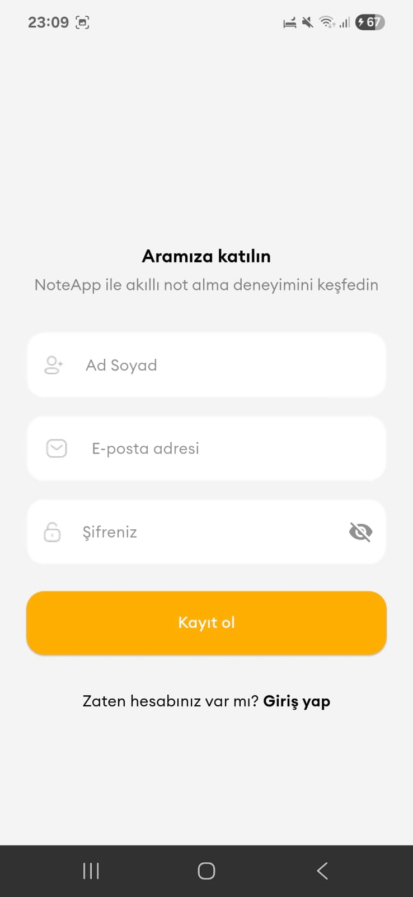
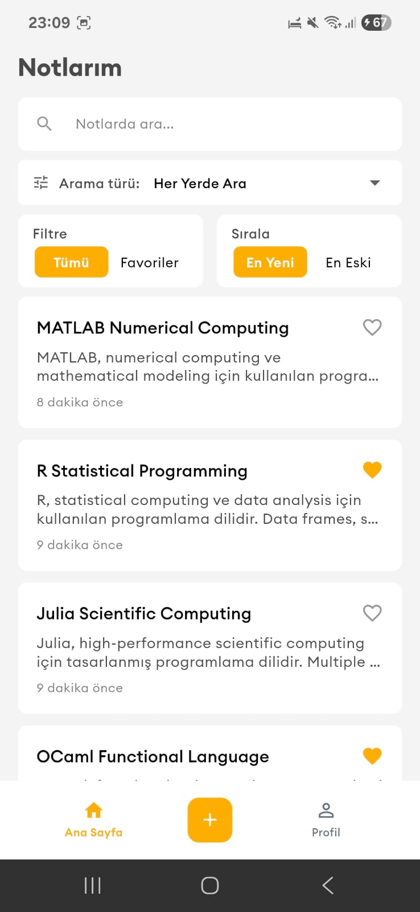
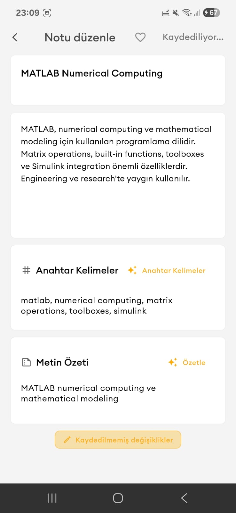
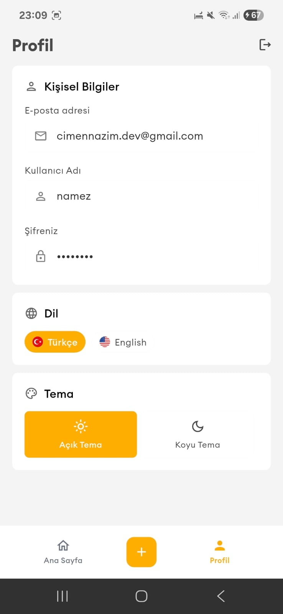
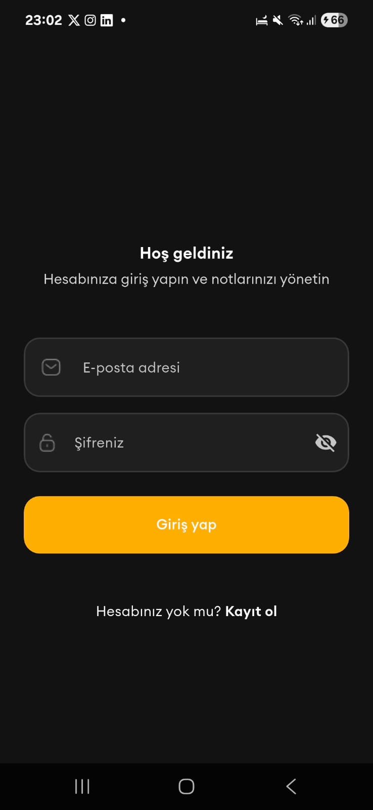
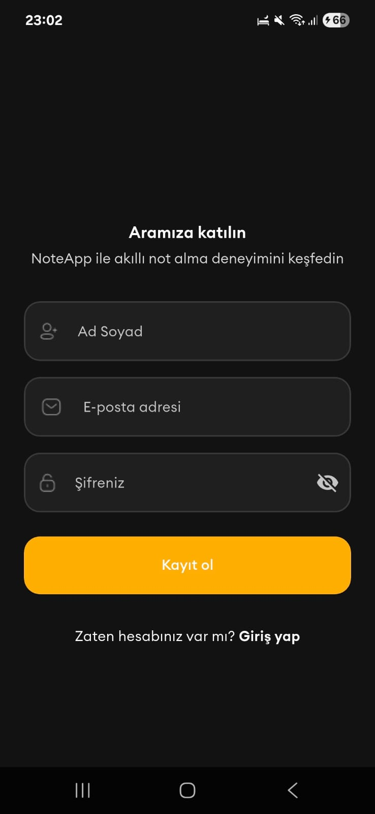
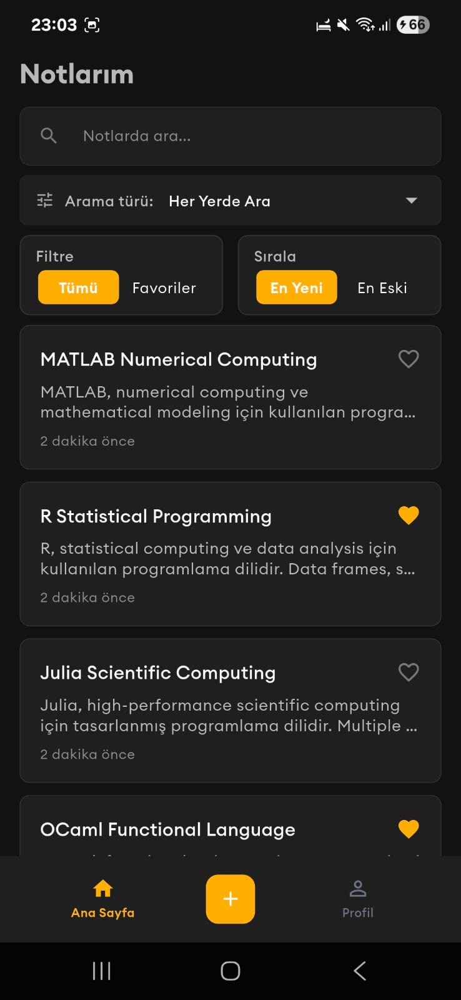
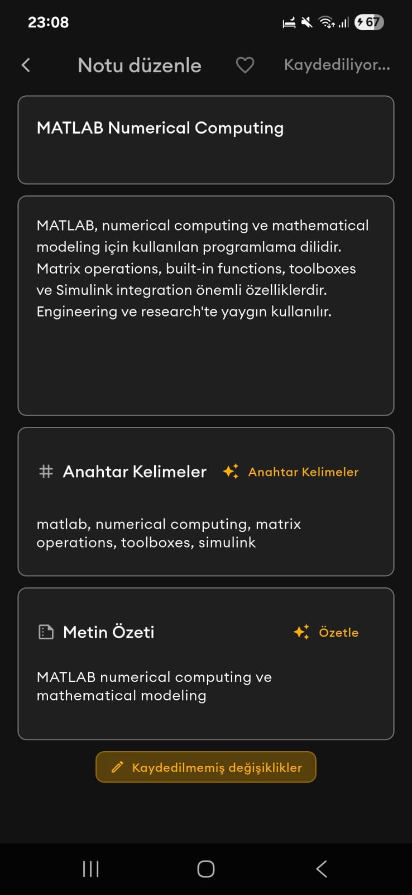
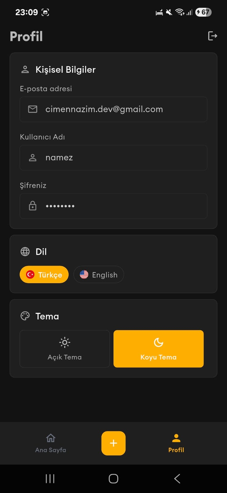

# 📝 NoteApp - Modern Note-Taking Application

<div align="center">
  
  
  <p><em>A comprehensive Flutter application built with Clean Architecture principles, featuring AI-powered note enhancement, real-time authentication, and advanced filtering capabilities.</em></p>
</div>

## 🏗️ Architecture Overview

This project follows **Clean Architecture** principles with clear separation of concerns across three main layers:

- **🎯 Domain Layer**: Contains business logic, entities, and use cases
- **📊 Data Layer**: Handles data sources, models, and repository implementations  
- **🎨 Presentation Layer**: Manages UI components, state management, and user interactions

### Key Architectural Features:
- **Dependency Injection** using GetIt service locator
- **Repository Pattern** for data abstraction
- **Use Case Pattern** for business logic encapsulation
- **Bloc/Cubit** for reactive state management
- **Error Handling** with Either pattern using Dartz

## 📁 Project Structure

```
lib/
├── core/                           # Core functionality and configurations
│   ├── config/                     # App configurations
│   │   ├── localization/          # Internationalization setup
│   │   ├── routes/                # Navigation routes
│   │   └── theme/                 # Theme management
│   ├── error/                     # Error handling utilities
│   ├── init/                      # App initialization
│   ├── network/                   # Network configuration
│   └── utils/                     # Utility functions
├── data/                          # Data layer implementation
│   ├── datasources/              # Data sources (local & remote)
│   ├── models/                   # Data models with serialization
│   ├── repositories/             # Repository implementations
│   └── services/                 # External services
├── domain/                       # Domain layer (business logic)
│   ├── entities/                 # Business entities
│   ├── repositories/             # Repository interfaces
│   └── usecases/                 # Business use cases
├── presentation/                 # Presentation layer (UI)
│   ├── auth/                     # Authentication screens
│   ├── home/                     # Home screen with notes list
│   ├── layout/                   # App layout components
│   ├── note/                     # Note creation/editing
│   ├── profile/                  # User profile management
│   └── splash/                   # Splash screen
└── shared/                       # Shared components and utilities
    ├── components/               # Reusable UI components
    ├── constants/                # App constants
    ├── decorations/              # Input decorations
    └── widgets/                  # Custom widgets
```

## 📱 Screenshots

### Light Theme
<div align="center">
  
  
  
  
  
</div>

### Dark Theme
<div align="center">
  
  
  
  
  
</div>

## 🚀 Key Features

### 🔐 Authentication & Security
- **Supabase Integration**: Complete authentication system with email/password
- **JWT Token Management**: Automatic token refresh with interceptor
- **Secure Storage**: Encrypted storage for sensitive data
- **Session Management**: Persistent login state across app restarts

### 🤖 AI-Powered Features
- **Google Gemini Integration**: AI-powered content enhancement
- **Smart Keywords Generation**: Automatic keyword extraction from note content
- **Intelligent Summarization**: AI-generated note summaries
- **Multi-language Support**: AI responses in Turkish and English

### 📱 Advanced Note Management
- **Infinite Scroll Pagination**: Efficient loading with 10 notes per page
- **Advanced Filtering**: Filter notes by favorites, date, and content
- **Smart Sorting**: Sort by newest, oldest, or relevance
- **Real-time Search**: Search across titles, content, or both
- **Favorites System**: Mark and manage favorite notes

### 🎨 User Experience
- **Dark/Light Theme**: Seamless theme switching with persistence
- **Responsive Design**: Optimized for all screen sizes
- **Internationalization**: Full Turkish and English language support
- **Smooth Animations**: Polished UI transitions and interactions

## 🛠️ Technology Stack

### Core Technologies
- **Flutter 3.8.1+**: Cross-platform mobile development
- **Dart**: Programming language
- **Clean Architecture**: Scalable and maintainable code structure

### State Management
- **Flutter Bloc**: Reactive state management
- **Provider**: Dependency injection and state management

### Backend & Authentication
- **Supabase**: Backend-as-a-Service for authentication and database
- **Dio**: HTTP client for API communication
- **JWT**: Secure token-based authentication

### Local Storage
- **Hive**: Fast NoSQL database for local caching
- **SharedPreferences**: Simple key-value storage
- **Flutter Secure Storage**: Encrypted storage for sensitive data

### AI & External Services
- **Google Gemini API**: AI-powered content generation
- **Internet Connection Checker**: Network connectivity monitoring

### UI & Design
- **Google Fonts**: Typography
- **Flutter ScreenUtil**: Responsive design utilities
- **Easy Localization**: Internationalization support


## 📱 Features in Detail

### Authentication Flow
- **Login/Signup**: Email and password authentication via Supabase
- **Token Management**: Automatic JWT token refresh on API calls
- **Session Persistence**: Maintains login state across app restarts
- **Secure Logout**: Complete session cleanup and token removal

### Note Management
- **Create Notes**: Rich text editor with AI enhancement
- **Edit Notes**: In-place editing with auto-save functionality
- **Delete Notes**: Soft delete with confirmation dialogs
- **Favorites**: Toggle favorite status with instant UI updates
- **Pagination**: Load notes 10 at a time for optimal performance and smooth scrolling

### AI Integration
- **Smart Keywords**: AI extracts relevant keywords from note content
- **Content Summarization**: AI generates concise summaries
- **Multi-language**: AI responses adapt to user's language preference
- **Error Handling**: Graceful fallback when AI services are unavailable

### Search & Filter
- **Real-time Search**: Instant search across note titles and content
- **Advanced Filters**: Filter by favorites, date ranges, and categories
- **Smart Sorting**: Multiple sorting options with persistent preferences
- **Pagination**: Efficient loading with 10 notes per page for optimal performance and smooth scrolling

### Performance Optimization
- **Infinite Scroll Pagination**: Loads 10 notes per page to ensure smooth scrolling
- **Lazy Loading**: Notes are loaded on-demand as user scrolls
- **Memory Management**: Efficient memory usage with pagination
- **Network Optimization**: Reduces API calls and bandwidth usage

### Theme & Localization
- **Theme Switching**: Toggle between light and dark themes
- **Language Support**: Full Turkish and English localization
- **Persistent Settings**: User preferences saved across sessions
- **Responsive Design**: Optimized for various screen sizes


## 📦 Dependencies

### Production Dependencies
- **State Management**: `flutter_bloc`, `provider`
- **Navigation**: `go_router`
- **Network**: `dio`, `supabase_flutter`
- **Storage**: `hive`, `shared_preferences`, `flutter_secure_storage`
- **AI**: Google Gemini API integration
- **UI**: `google_fonts`, `flutter_screenutil`
- **Localization**: `easy_localization`, `intl`

### Development Dependencies
- **Code Generation**: `json_serializable`, `build_runner`, `freezed`
- **Testing**: `mockito`
- **Code Quality**: `very_good_analysis`


## 🔧 Setup & Installation

### Prerequisites
- Flutter SDK 3.8.1 or higher
- Dart SDK
- Android Studio / VS Code
- Supabase account
- Google Gemini API key

### Environment Configuration
1. Create a `.env` file in the project root:
```env
SUPABASE_URL=your_supabase_url
SUPABASE_ANON_KEY=your_supabase_anon_key
GEMINI_API_KEY=your_gemini_api_key
```

### Installation Steps
1. **Clone the repository**
```bash
git clone <repository-url>
cd flutter_note_app
```

2. **Install dependencies**
```bash
flutter pub get
```

3. **Generate code**
```bash
flutter packages pub run build_runner build
```

4. **Run the application**
```bash
flutter run
```
